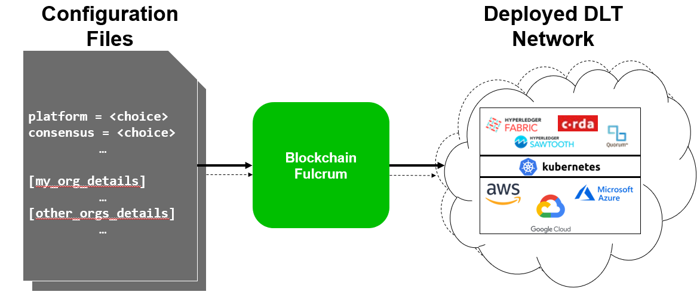

# **Overview**

In general terms, a blockchain is an immutable transaction ledger, maintained within a distributed network of peer nodes. These nodes each maintain a copy of the ledger by applying transactions that have been validated by a consensus protocol, grouped into blocks that include a hash that bind each block to the preceding block.

The first and most widely recognized application of blockchain is the Bitcoin cryptocurrency, though others have followed in its footsteps. Ethereum, an alternative cryptocurrency, took a different approach, integrating many of the same characteristics as Bitcoin but adding smart contracts to create a platform for distributed applications. Bitcoin and Ethereum fall into a class of blockchain that we would classify as public permissionless blockchain technology. Basically, these are public networks, open to anyone, where participants interact anonymously.

As the popularity of Bitcoin, Ethereum and a few other derivative technologies grew, interest in applying the underlying technology of the blockchain, distributed ledger and distributed application platform to more innovative enterprise use cases also grew. However, many enterprise use cases require performance characteristics that the permissionless blockchain technologies are unable (presently) to deliver. In addition, in many use cases, the identity of the participants is a hard requirement, such as in the case of financial transactions where Know-Your-Customer (KYC) and Anti-Money Laundering (AML) regulations must be followed.

For enterprise use, we need to consider the following requirements:
- Participants must be identified/identifiable
- Networks need to be permissioned
- High transaction throughput performance
- Low latency of transaction confirmation
- Privacy and confidentiality of transactions and data pertaining to business transactions

While many early blockchain platforms are currently being adapted for enterprise use, Hyperledger Fabric has been designed for enterprise use from the outset. The following sections describe how Hyperledger Fabric (Fabric) differentiates itself from other blockchain platforms and describes some of the motivation for its architectural decisions.

## **Blockchain Fulcrum Automated Platform**
Arising star in the business world, Blockchain as a Service, when a third-party installs and maintains blockchain networks for a company’s technologies helps businesses develop and host blockchain apps and smart contracts in a blockchain ecosystem that's managed and administered by cloud-based service providers. Fulcrum exactly do the same with much more added functionality. It is created by keeping in mind that  best-practices are followed by default to ensure consistent adherence across projects.Flexible environment scaling makes platform applicable from rapid demos through production deployments.

A means to consistently deploy production-ready DLT networks

## **How it is different from other BAAS**
- Blockchain fulcrum deployment scripts are being reused across cloud providers like AWS,Azure,GCP
- Can deploy multiple smart contracts across different platforms
- Specify only number of organizations and the number of nodes per organization on the network.yaml. Blockchain network will be ready.
- External dependencies which is having Apache 2.0 license (preferred) or alternatively be a compatible BSD license is only used not GPL licenses.
- Providing two types of application on top of platform to be used in trade finance and supply chain projects.

--more content TBA--